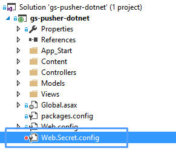
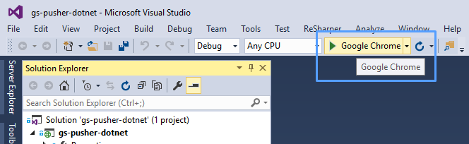
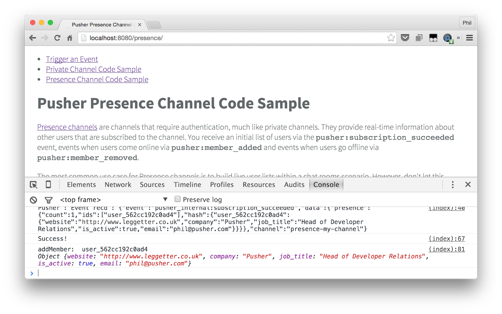

# Getting Started: Pusher and .NET

A getting started example when using the [Pusher .NET HTTP API library](https://github.com/pusher/pusher-http-dotnet) with ASP.NET MVC.

This repo gives you the absolute basics required to get started. It doesn't provide you with full examples so should be used as a quick getting started template or a reference.

## Examples

* [How to trigger an event from your server](gs-pusher-dotnet/Views/Trigger/Index.cshtml)
* [Using Private Channels](gs-pusher-dotnet/Views/Private/Index.cshtml)
* [Using Presence Channels](gs-pusher-dotnet/Views/Private/Index.cshtml)

**Todo:**

* Triggering the same event on multiple channels
* How to trigger an event from your client (client events)
* Querying application state

## Installation

Open the solution in [Visual Studio Community](https://www.visualstudio.com/en-us/downloads/download-visual-studio-vs.aspx) **2015+**.

## Run the examples

Prior to running the ASP.NET MVC app you'll need some application settings to be set.

Create a new file in your solution root called `Web.Secret.config` (this is **case sensitive**):



Then paste the following text and replace the placeholder `value`s with your own:

```xml
<appSettings>
  <add key="PusherAppId" value="YOUR_APP_ID" />
  <add key="PusherAppKey" value="YOUR_APP_KEY" />
  <add key="PusherAppSecret" value="YOUR_APP_SECRET" />
</appSettings>
```

Finally, run the website either by pressing `F5` or by clicking this start button in Visual Studio:



Your browser should automatically open at `http://localhost:<random_port>`. Take a look at the examples and view the JavaScript console for a log from the Pusher JavaScript library.


